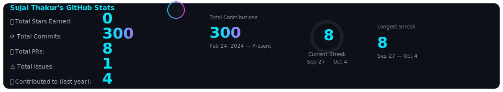
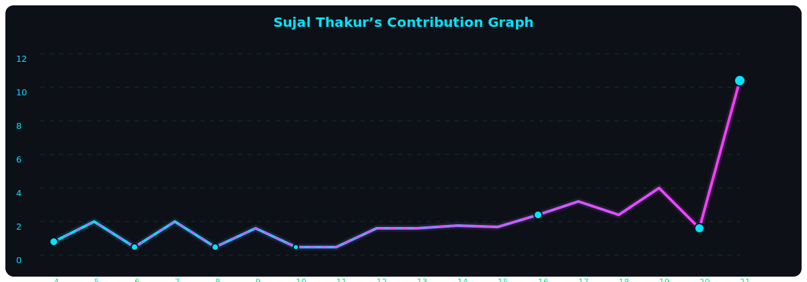

<!-- =============================== -->
<!-- 🚀 SUJAL THAKUR | README 2025  -->
<!-- =============================== -->

<!-- Hero -->
<h1 align="center">
  
</h1>

<!-- Pixel Cyber Banner -->

  

---

### 👨‍💻 About Me
- 🚀 Full-stack dev who ships fast, breaks things, then fixes them at 3 a.m.  
- 🔧 DevOps enjoyer — CI/CD, infrastructure as code, containers, the whole chaos.  
- 🧩 I learn whatever any **hackathon / competition / company** throws my way — and master it.  
- 🧑‍🤝‍🧑 Open-source contributor; always up for collabs that spark learning & impact.  

### 🧭 What I’m Doing Now
- 🧱 Building MERN apps, improving DX, and automating deploys.  
- 🧠 Grinding DSA + systems to stay interview-ready.  
- 🌐 College + IEEE/club leadership + community events (public speaking & ops).  

---

### 🛠️ Tech Stack

  
  
  
  
  
  
  
  
  
  
  
  
  

---

### 🏆 GitHub Trophy Wall

  

---

### 🔗 Quick Links

  
  
  
  

---

### ⚙️ Now
- 🧠 Building a couple of MERN projects + DX polish + auto-deploys  
- 📘 Learning: DSA patterns, OS/DBMS refresh, clean DevOps pipelines  
- 📖 Reading: docs, commit history — and the future (through logs)

### 🤝 Open To
- 💼 SDE/SWE internships • 🧩 OSS collabs • 🏁 Hackathons • 🎤 Speaking/Workshops

---

## ⚡ GitHub Metrics (Neon Glow — Static SVGs)

  

  

  

---

### 💬 Ask Me About
Frontend/Backend (MERN), DevOps & CI/CD, system design basics, DSA patterns, hackathon strategy, and turning ideas into shipped products.

### 📫 Reach Me
DM me on LinkedIn or open an Issue/Discussion on this repo.

---

  © Sujal Thakur 2025 • Hack the Planet ⚡

